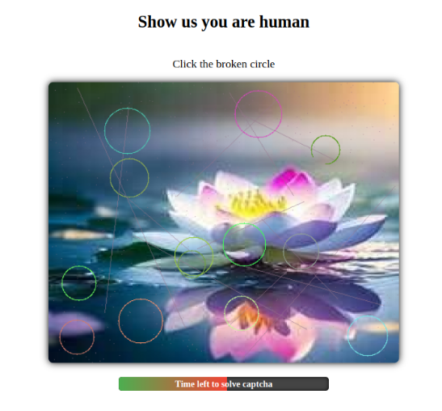

📦 Install via [Packagist](https://packagist.org/packages/forutan/ccaptcha)  
🐙 View source on [GitHub](https://github.com/yaservaziri/ForutanCCaptcha)

# CCaptcha – Laravel Image-Based CAPTCHA

**Forutan CCaptcha** is a lightweight, customizable Laravel package that adds an interactive, circle-based CAPTCHA system to protect your forms, logins, and sensitive routes.  
It ensures that only real humans can pass your verification flow — without ugly distorted text or annoying puzzles.

---

## 🚀 Features

- ✅ Circle-based, click-to-verify CAPTCHA  
- 🧠 Human-friendly & accessible design  
- 🔒 Built-in brute-force protection and blocking  
- 🕒 Time-based expiration control  
- ⚡ Easy Laravel integration with middleware & routes  
- 🖼️ Optimized background image pre-processing command  
- 🧩 Works out of the box — no external APIs or keys 

---



---

## 📦 Installation

Install the package via Composer:
```bash
composer require forutan/ccaptcha
```

---

## 🖼️ Prepare CAPTCHA Images

To make the circle CAPTCHA more resistant against bots and OCR attacks, **we use randomized background images** behind the circles.  
These images create visual noise and texture that make it much harder for automated scripts to detect patterns — while keeping the challenge easy for humans.

You can use your own background images (e.g. nature, textures, abstract art) or rely on the default ones bundled with the package.

Before using them in production, it's **strongly recommended** to preprocess the images to:
- 🧹 **Remove all EXIF/metadata** (to protect user privacy)
- 📏 **Resize** them to the optimal dimensions for the captcha
- 🗜️ **Compress** them for fast loading
- 🧩 **Standardize format** to `.jpg`

This can be done using the included Artisan command:

```bash
php artisan ccaptcha:prepare-images
```

By default, this command uses the package’s internal seed images.
You can also specify your own image source directory:

```bash
php artisan ccaptcha:prepare-images --from=/path/to/your/images
```

All cleaned and resized images will be stored securely in:

```
storage/app/private/ccaptcha/
```

## 🛡️ Middleware Usage
Protect your routes with the `ccaptcha.verified` middleware and a context name (e.g. login, checkout, comment, etc.):


```php
Route::get('/dashboard', function () {
    // Protected content here
})->middleware('ccaptcha.verified:login');

Route::middleware('ccaptcha.verified:checkout')->group(function () {
    Route::get('/checkout', fn () => view('checkout'));
    Route::post('/checkout/pay', fn () => 'Processing payment...');
});
```
Each context is validated independently, so you can use different CAPTCHA challenges across different parts of your app.

---

## ⚙️ Configuration

Customize UI and logic with the following:

### Blade View

```bash
php artisan vendor:publish --tag=ccaptcha-views
```

Now edit it in:

```
resources/views/vendor/ccaptcha/
```

### Config File

```bash
php artisan vendor:publish --tag=ccaptcha-config
```

Now edit in:

```
config/ccaptcha.php
```

Sample Settings::
You can define different settings per context (e.g. login, checkout, comment) for maximum flexibility.

```php
    /*
    |--------------------------------------------------------------------------
    | CAPTCHA Expiration
    |--------------------------------------------------------------------------
    |
    | Determines how long (in seconds) a generated captcha remains valid
    | before it expires and requires regeneration.
    |
    */
    'expire_seconds' => 30,

    /*
    |--------------------------------------------------------------------------
    | Attempt & Blocking Policy
    |--------------------------------------------------------------------------
    |
    | - max_attempts: number of failed verifications allowed per session
    | - block_duration_minutes: user is blocked for this many minutes after
    |   exceeding max_attempts.
    |
    */
    'max_attempts' => 5,
    'block_duration_minutes' => 60,

    /*
    |--------------------------------------------------------------------------
    | Routing & Middleware
    |--------------------------------------------------------------------------
    |
    | The prefix defines the base URL for captcha routes.
    | The middleware stack defines what should run before showing captcha.
    |
    */
    'route_prefix' => 'ccaptcha',
    'middleware' => ['web'],

    /*
    |--------------------------------------------------------------------------
    | Rate Limiting
    |--------------------------------------------------------------------------
    |
    | These throttle settings prevent abuse or spam requests
    | for both showing and verifying captcha.
    | Format: "<max_attempts>,<minutes>"
    |
    */
    'throttle' => [
        'show' => '60,1',
        'verify' => '20,1',
    ],

    /*
    |--------------------------------------------------------------------------
    | Redirects
    |--------------------------------------------------------------------------
    |
    | Define where users should be redirected after successfully passing
    | the captcha challenge. You can specify per-context redirects if needed.
    |
    */
    'redirect_on_pass' => [
        'default' => '/',
    ],

    /*
    |--------------------------------------------------------------------------
    | Image Settings
    |--------------------------------------------------------------------------
    |
    | Default image processing configuration used by the
    | `ccaptcha:prepare-images` command and the controller.
    |
    | - image_width / image_height define final image dimensions
    | - image_quality controls compression level (1–100)
    | - storage_path defines where prepared captcha images are stored
    |
    */
    'image_width' => 500,
    'image_height' => 400,
    'image_quality' => 90,
    'storage_path' => storage_path('app/private/ccaptcha'),
    'radius_min' => 20,
    'radius_max' => 35,
    'min_circle_count' => 10,
    'max_circle_count' => 15
```

---

## 🤝 Contributing

Pull requests, issues, and feedback are welcome! 

---

## ☕ Support

If you find CCaptcha helpful:

👉 [Donate here](https://yaservaziri.github.io/ForutanCCaptcha/donate.html)

---

## 💼 Commercial License

Need this for a commercial product?

👉 [Request license](mailto:forutan.vaziri@gmail.com?subject=Commercial%20License%20Inquiry%20-%20CCaptcha)
